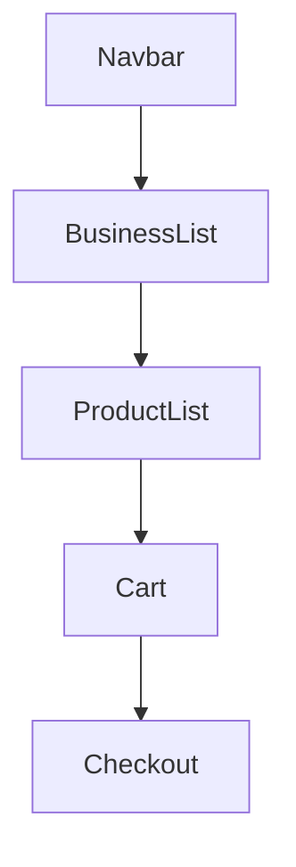
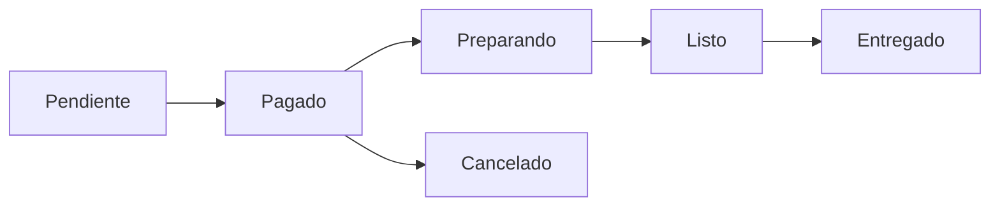

# Design System – BeanQuick

Este documento describe los principios visuales y de experiencia de usuario del sistema.

---

# Design Concept

BeanQuick utiliza un diseño inspirado en aplicaciones modernas de pedidos como:

- Uber Eats
- Rappi
- Starbucks Mobile Order

Principios:

- simplicidad
- velocidad
- claridad visual

---

# Color Palette

Colores principales:

Primary

```
#6F4E37
Coffee Brown
```

Secondary

```
#C89B7B
Light Coffee
```

Background

```
#F5F5F5
```

Success

```
#28A745
```

---

# Typography

Tipografía recomendada:

Primary Font

```
Inter
```

Fallback

```
Roboto
```

---

# UI Components

## Product Card

Contiene:

- imagen
- nombre
- precio
- botón agregar

---

## Business Card

Contiene:

- logo
- nombre de cafetería
- ubicación
- botón ver productos

---

## Cart Component

Incluye:

- lista de productos
- cantidades
- total del pedido
- botón pagar

---

# Layout Structure



---

# UX Principles

El sistema sigue principios de:

1. **mínima fricción**
2. **feedback inmediato**
3. **claridad en el estado del pedido**

---

# Order Status UX



Cada estado se muestra visualmente con:

- colores
- iconos
- badges