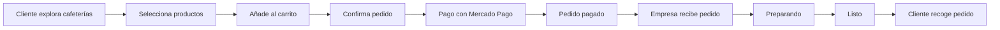
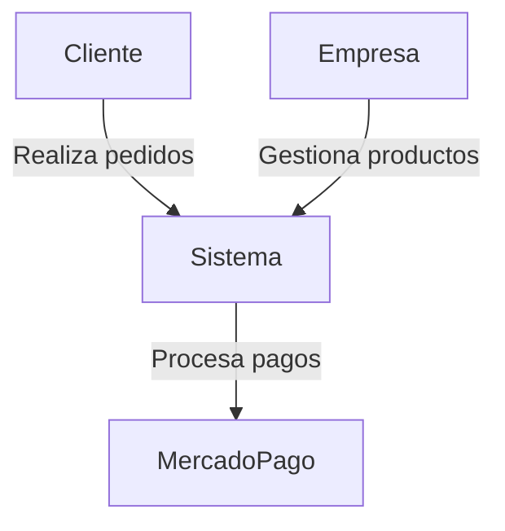

# Project Scope – BeanQuick

## Overview

**BeanQuick** es una plataforma web diseñada para optimizar el proceso de compra en cafeterías permitiendo a los clientes **realizar pedidos y pagarlos antes de llegar al establecimiento**.

El objetivo principal es **reducir tiempos de espera, mejorar la experiencia del cliente y facilitar la gestión de pedidos para las cafeterías**.

---

# Problem Statement

En muchas cafeterías los clientes deben:

- Hacer fila
- Esperar preparación
- Perder tiempo en horas pico

BeanQuick resuelve este problema permitiendo:

- Pedir desde el celular o computador
- Pagar anticipadamente
- Recoger el pedido listo

---

# Target Users

## Customer (Cliente)

Usuarios que desean:

- explorar cafeterías
- pedir productos
- pagar en línea
- recoger sin hacer fila

## Business (Empresa)

Cafeterías que desean:

- digitalizar su menú
- recibir pedidos anticipados
- gestionar pedidos eficientemente

---

# Core Features

## Authentication

Usuarios pueden:

- registrarse
- iniciar sesión
- gestionar su perfil

---

## Business Discovery

Los clientes pueden:

- explorar cafeterías
- ver información del negocio
- revisar productos disponibles

---

## Product Catalog

Cada empresa puede:

- crear productos
- editar productos
- eliminar productos
- gestionar precios

---

## Shopping Cart

Los clientes pueden:

- agregar productos
- modificar cantidades
- eliminar productos
- revisar su pedido

---

## Order Management

Los pedidos pasan por estados:

- Pendiente
- Pagado
- Preparando
- Listo
- Entregado
- Cancelado

---

## Payments

BeanQuick integra **Mercado Pago** para procesar pagos de manera segura.

---

# Business Rules

1. Un cliente solo puede tener **un carrito activo por empresa**.
2. Un pedido no puede modificarse después de ser pagado.
3. Las empresas solo pueden gestionar **sus propios productos**.
4. Los pedidos deben tener un **estado válido** dentro del flujo definido.

---

# Order Flow Diagram

---

# System Actors

