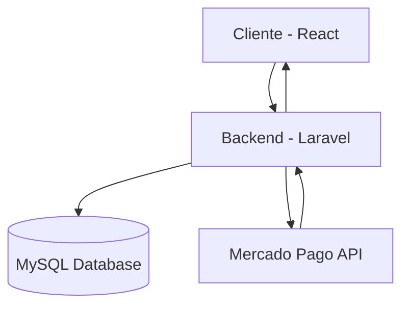

# Tech Stack – BeanQuick

Este documento describe las tecnologías utilizadas en el desarrollo del sistema.

---

# Frontend

El frontend está construido utilizando:

- **React**
- **JavaScript**
- **Bootstrap**
- **Axios**

Responsabilidades:

- Interfaz de usuario
- Gestión de estado del carrito
- Comunicación con el backend

---

# Backend

El backend está construido con:

- **Laravel**
- **PHP**

Responsabilidades:

- lógica del negocio
- autenticación
- gestión de pedidos
- gestión de productos
- integración con pagos

---

# Database

Base de datos utilizada:

- **MySQL**

Responsabilidades:

- almacenamiento de usuarios
- productos
- pedidos
- empresas

---

# Authentication

El sistema utiliza:

**Laravel Breeze**

para manejar:

- registro
- login
- sesiones
- protección de rutas

---

# Payments

La plataforma integra:

**Mercado Pago API**

para:

- procesar pagos
- confirmar transacciones
- actualizar estado de pedidos

---

# Version Control

Control de versiones:

- **Git**
- **GitHub**

Flujo de trabajo:

```
main
│
├── feature/auth
├── feature/cart
├── feature/payments
```

---

# Technology Architecture



---

# Development Tools

Herramientas utilizadas durante el desarrollo:

- Visual Studio Code
- Postman
- Git
- npm
- Composer

---

# Deployment (Future)

Posibles opciones de despliegue:

- VPS
- Docker
- Cloud hosting